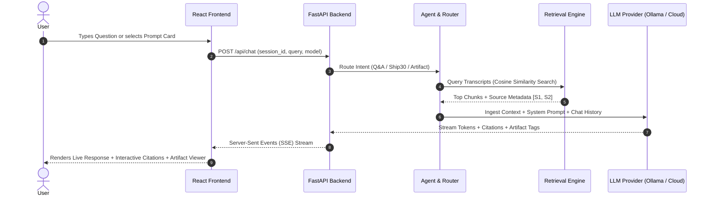

# Product Requirements Document (PRD)
## The Lenny Growth Assistant — Internal Intelligence Workspace

---

## 1. Executive Summary & Forward Deployment Brief

### 1.1 User Persona & Problem Statement
* **Primary Users**: Product Managers (PMs), Heads of Growth, Early-stage Founders, Product Marketing Managers (PMMs), and Strategy Operators.
* **Core Job-to-be-Done (JTBD)**: "When I am designing a growth strategy, prioritizing features, or writing product memos, I want to query the collective wisdom of Lenny's Podcast and Newsletter guests, understand the exact evidence and context behind their advice, and transform those insights into structured, publication-ready artifacts (Ship 30 for 30 essays, PRD templates, growth loop visualizers) in minutes."
* **Pain Point Removed**: Sifting through hundreds of hours of video/audio podcasts is infeasible during fast-paced product cycles. Generic LLMs fabricate quotes, confuse guest frameworks, hallucinate sources, and cannot natively render interactive or styled artifacts safely.

### 1.2 Measurable Success Metrics
| Metric Category | Target Objective | Measurement Mechanism |
| :--- | :--- | :--- |
| **Grounded Citation Rate** | $\ge 95\%$ | Percentage of factual knowledge answers citing at least one valid episode/speaker `[S1]`, `[S2]` badge. |
| **Hallucination & Out-of-Scope Safety** | $100\%$ refusal on out-of-corpus queries | Zero fabricated claims for non-transcript domains (e.g. quantum computing, astrophysics). Returns explicit evidence boundary + suggested topics. |
| **Artifact Generation & Render Speed** | $< 2.0\text{ seconds}$ | End-to-end generation and render of complete Markdown / isolated HTML artifacts in the dedicated side viewer. |
| **Local Model Self-Sufficiency** | $100\%$ functional locally | Complete operation using local Ollama (`llama3.1:8b`, `mistral`, `phi3`) with automatic fallback to Cloud (Claude 3.5 Sonnet / GPT-4o). |

### 1.3 Key Assumptions
1. **Source Corpus**: The initial transcript base is curated from Lenny's top product and growth episodes (Brian Chesky, Elena Verna, Shreyas Doshi, Sean Ellis, April Dunford, Rahul Vohra, Casey Winters) with an open ingestion pipeline for full corpus expansion.
2. **Evaluator Environment**: Evaluators may run the project with or without a running Ollama daemon; hence, an automatic graceful provider fallback and built-in offline mock provider are included to guarantee flawless zero-config evaluation.
3. **Artifact Security**: User-generated and model-generated HTML/CSS snippets must be treated as untrusted and isolated within a sandboxed `iframe` without access to host DOM, cookies, or storage.

### 1.4 Scope Choices & Prioritization

#### In Scope (Must-Haves)
- **FastAPI Async Backend** with REST & SSE endpoints, request ID logging, and structured error envelopes.
- **Persistent Sessions & Messages** backed by SQLAlchemy (PostgreSQL / SQLite hybrid) maintaining independent conversation states.
- **Traceable Hybrid RAG** with semantic chunking, cosine similarity retrieval, and dynamic citation mapping (`[S1]`, `[S2]`).
- **Ship 30 for 30 Content Skill**: Dedicated agent tool turning grounded insights into ~1,250-word structured essays following digital writing best practices.
- **In-App Artifact Viewer**: Dual-mode (Rendered Preview vs. Raw Code/Markdown) with isolated sandboxed rendering for HTML/CSS and Markdown.
- **Multi-Provider LLM Switcher**: Dynamic runtime toggle between Local Ollama, Anthropic Claude, and OpenAI with visual health status.
- **Interactive Sources Drawer**: Detailed transcript cards with guest names, episode IDs, relevance %, passage quotes, and full transcript viewer.

#### Explicitly Out of Scope (Trade-offs for FDE focus)
- Multi-tenant user auth & billing (unnecessary overhead for a local evaluator demo).
- Full speech-to-text audio pipeline (audio files are pre-transcribed).
- Complex microservice orchestration (monolithic multi-container Docker Compose is simpler to run, test, and maintain).

---

## 2. User Experience & Application Flows

---

## 3. Product Skills Specification

### 3.1 Grounded Q&A Assistant
- Formats answers into:
  1. **Executive Summary / Direct Answer**
  2. **Core Insights & Frameworks (Numbered & Bold)**
  3. **Strategic Takeaway for the Operator**
  4. **Source Footnotes & Clickable Badges**
- Graceful refusal when evidence is lacking.

### 3.2 Ship 30 for 30 Content Skill (`/api/skills/ship30`)
- Transforms transcript knowledge into high-impact digital essays:
  - **Hook**: Compelling 1-sentence opening that challenges conventional wisdom.
  - **The 1/3/1 Writing Cadence**: Short intro, 3-point structured body, punchy conclusion.
  - **Formatting**: Bold highlights, skimmable bullet points, actionable checklists.
  - **Length**: ~1,250 words.
  - **Grounding**: Seamlessly weaves real anecdotes from Lenny's guests into the narrative.

### 3.3 Interactive Artifact Builder (`/api/skills/artifact`)
- Generates rich interactive artifacts:
  - **Growth Loop Simulator** (Interactive HTML/JS slider calculating compounding user loops).
  - **Sean Ellis PMF Survey Calculator** (HTML/JS widget calculating % Very Disappointed).
  - **Shreyas Doshi LNO Work Planner** (Markdown / HTML task triage matrix).
  - **April Dunford Positioning Canvas** (Executive presentation card).

---

## 4. Non-Functional & Security Requirements
- **Performance**: Time-to-First-Token (TTFT) $< 800\text{ms}$ on cloud providers and $< 1.5\text{s}$ on local Ollama.
- **Security**: Content Security Policy (CSP) + iframe sandbox attributes: `sandbox="allow-scripts"` (strictly avoiding `allow-same-origin` or `allow-top-navigation`).
- **Resilience**: Automatic retry on transient provider timeouts; graceful downgrade to fallback models.
- **Observability**: Structured JSON logging on every request with UUID `request_id`, retrieval latency, and token metrics.
