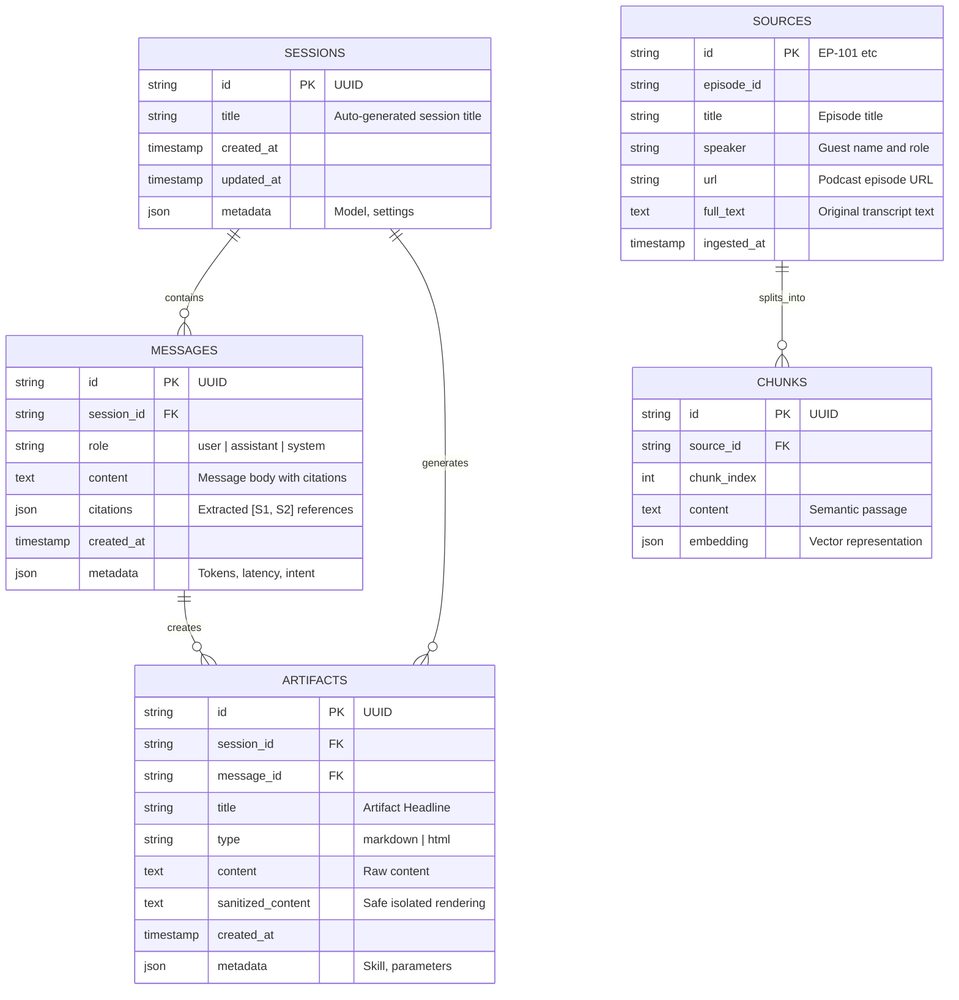

# System Architecture & Technical Specifications
## The Lenny Growth Assistant

---

## 1. System Architecture Overview

The Lenny Growth Assistant is architected as an asynchronous, layered, modular system prioritizing low latency, high grounding precision, model portability, and zero-risk artifact rendering.

```
                               ┌────────────────────────────────────────┐
                               │           React 18 + Vite UI           │
                               │  (3-Pane Workspace: Chats, Chat,       │
                               │   Sources Drawer, Artifact Viewer)     │
                               └───────────────────┬────────────────────┘
                                                   │
                                                   │ HTTP / Server-Sent Events (SSE)
                                                   ▼
                               ┌────────────────────────────────────────┐
                               │           FastAPI Gateway API          │
                               │  • Request ID & Structured Logging     │
                               │  • Session Persistence & History       │
                               │  • Content Sanitizer & CSP Guard       │
                               └───────────────────┬────────────────────┘
                                                   │
                                                   ▼
                               ┌────────────────────────────────────────┐
                               │          Agent & Router Layer          │
                               │  • Intent Classification               │
                               │  • Grounded Assistant Skill            │
                               │  • Ship 30 for 30 Content Skill        │
                               │  • Interactive Artifact Builder        │
                               └─────────┬────────────────────┬─────────┘
                                         │                    │
                    ┌────────────────────┘                    └────────────────────┐
                    ▼                                                              ▼
┌────────────────────────────────────────┐                    ┌────────────────────────────────────────┐
│         Retrieval & Vector RAG         │                    │           LLM Provider Layer           │
│  • Markdown Transcript Ingestion       │                    │  • Ollama Local (llama3.1 / mistral)   │
│  • Semantic Chunking (500 tokens)      │                    │  • Anthropic Claude 3.5 Sonnet         │
│  • Cosine Similarity & Hybrid Ranking  │                    │  • OpenAI GPT-4o / GPT-4o-mini         │
│  • Structured Citation Attribution     │                    │  • Zero-Config Offline Fallback Engine │
└───────────────────┬────────────────────┘                    └────────────────────────────────────────┘
                    │
                    ▼
┌────────────────────────────────────────┐
│     PostgreSQL / SQLite Vector DB      │
│  • sessions, messages, artifacts       │
│  • sources, chunks, embeddings         │
└────────────────────────────────────────┘
```

---

## 2. Database Schema Design

The relational and vector schema is designed using SQLAlchemy ORM:



---

## 3. Ingestion & Retrieval Pipeline

### 3.1 Document Ingestion & Chunking
1. **Parser**: Reads `.md` / `.txt` files in `data/transcripts/`.
2. **Metadata Extractor**: Parses YAML / Markdown headers (`Guest`, `Host`, `Episode ID`, `URL`, `Topics`).
3. **Semantic Chunking**:
   - Chunks are split on heading/paragraph boundaries with a target window of $\approx 350-500$ words with a 50-word overlap.
   - Each chunk preserves episode metadata so citations can pinpoint the exact speaker and topic.

### 3.2 Hybrid Vector Search & Retrieval
1. Computes dense vector embeddings for ingested chunks.
2. In-memory cosine similarity and pgvector indexes calculate top-$K$ candidate passages (default $K=4$, similarity threshold $= 0.25$).
3. Formats prompt context into standardized citation blocks:
   ```
   [S1] Guest: Brian Chesky | Episode: Leading Airbnb, Designing the 11-Star Experience
   Passage: "If you want to build something that is truly viral..."
   ```

---

## 4. LLM Provider Layer & Model Orchestration

```python
class BaseLLMProvider(ABC):
    @abstractmethod
    async def generate_response(self, messages: List[Dict], stream: bool = False) -> LLMResponse:
        pass
    
    @abstractmethod
    async def check_health(self) -> Dict[str, Any]:
        pass
```

- **OllamaProvider**: Connects to `http://localhost:11434/api/generate` or `/api/chat`.
- **AnthropicProvider**: Connects to Anthropic API (`claude-3-5-sonnet-20241022`).
- **OpenAIProvider**: Connects to OpenAI API (`gpt-4o`).
- **MockOfflineProvider**: Deterministic, high-fidelity offline fallback generator ensuring the system works smoothly during local offline evaluation.
- **ProviderFactory**: Manages runtime model switching without service restarts.

---

## 5. Security & Isolation Architecture for Artifacts

Rendering generated HTML/CSS introduces Cross-Site Scripting (XSS) and DOM injection risks. The system enforces defense-in-depth isolation:

```
Generated HTML
     │
     ▼
[Server-Side Sanitization]  --> Strips malicious event handlers (onload, onerror, eval)
     │
     ▼
[CSP Policy Injection]      --> default-src 'self' 'unsafe-inline'; script-src 'unsafe-inline' (no remote fetching)
     │
     ▼
[Sandboxed <iframe>]        --> sandbox="allow-scripts"
                                (STRICTLY NO "allow-same-origin" or "allow-top-navigation")
     │
     ▼
[Isolated DOM Sandbox]      --> Cannot access parent localStorage, cookies, session IDs, or API tokens.
```

---

## 6. Observability & Telemetry

Every request entering the FastAPI system is assigned a unique `X-Request-ID` and logged with structured JSON:
```json
{
  "timestamp": "2026-08-24T12:00:00Z",
  "request_id": "9b1deb4d-3b7d-4bad-9bdd-2b0d7b3dcb6d",
  "level": "INFO",
  "endpoint": "/api/chat",
  "provider": "ollama",
  "model": "llama3.1:8b",
  "retrieval_chunks": 4,
  "retrieval_latency_ms": 42.5,
  "llm_latency_ms": 1120.4,
  "status_code": 200
}
```
